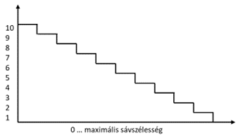

# Programozható Hálózatok
## Per Packet Value Remarking

### Csapat:
Molnár Dominik (rkqzs8@inf.elte.hu), Kovács Réka (rdgw40@inf.elte.hu)

### Probléma:
Csomagok egyenlőbb elosztása, felhasználók priorizálása.

### Megoldás:
- **Throughput mérése:** Az idő méréséhez a packet-ek timestamp-jét használjuk fel, úgy hogy ha az eltelt idő tegyük fel, hogy 1 másodperc, akkor mindig egész másodperctől egész másodpercig mérünk, így nem kell az eltelt időt tárolni. Amikor átlépünk a következő másodpercbe, akkor kezdő értéknek beállítjuk az első adott másodpercben érkezett csomag méretét és a további adott másodpercben érkező csomagok méretét hozzáadjuk majd. Így megkapjuk, hogy mekkora volt a throughput az adott másodpercben.
- **TVF, throughput value function:** Egy előre definiált skála szerint létrehozunk egy megfeleltető függvényt, mely bemenete a packet beérkezésekor mért throughput és ahhez rendel hozzá egy címkét, ami a packet prioritását jelöli.
  * Meghatározunk egy koordinátarendszert, ahol az x tengely 0-tól a maximális sávszélességig terjed, az y pedig 0-tól egy általunk választott egész számig, jelen esetben legyen 10. És felveszünk egy függvényt, mely egyenlő arányben egy egész számot rendel 1-től 10-ig minden throughput értékhez, hasonlóan mint az alábbi ábrán.
  
  * 0 és a bemeneti throughput között random számot generálunk.
  * Az így kapott számot behelyettesítjük az első pontban említett függvénybe.
  * Az így megkapott érték lesz a packet címkéje.
- **Eredmény mérése:**
  * Forgalmat generálunk adott rátával (pl. 10Mbps).
  * A küldött csomagokat felcímkézzük.
  * Fogadó oldalon számoljuk, hogy címkénként hány csomag érkezett, aminek egyenlő eloszlásúnak kell lennie a címkék szerint.

### A program futtatása:
- a program futtatásához olyan környezet szükséges ahol *python3* rendelkezésünkre áll!
- a *make* parancsot a *\prognet-bead\solution\prognet-bead* mappában állva adjuk ki
- ezután ha elindult a mininet környezet, a következő parancs szükséges: *xterm h1 h2*
- majd a **h2**-es ablak lesz a fogadó oldal, ehhez a következőre lesz szükség: *./receive.py*
- a **h1**-es ablak pedig a küldő oldal, itt két dologra van lehetőség
  * a *./send.py 10.0.2.2 "some message"* parancs hatására 1 db üzenetet tudunk egyszerre elküldeni, de ez nem fogja igazán megmutatni a feladatunk lényegét
  * ezért érdemes inkább a *./test.py 10.0.2.2 1000 250* parancsot kiadni, mellyel folyamatosan küldjük az üzeneteket, 1000-es hosszúságúak és 250 miliszekundumos várakozással mennek egymás után
- ha elindult az üzenetküldés, akkor a fogadó oldalon a konzolra kiírva megjelenítjük az elküldött csomagok címkéinek eloszlását, aminek indítás után kell egy kis idő, hogy beálljon, de kis várakozás után szépen látszik, hogy nagyából egyenletes az eloszlás
  * ha elkezdjük a várakozási időt csökkenteni, akkor látni kell a maximális címke egyre kisebb lesz
